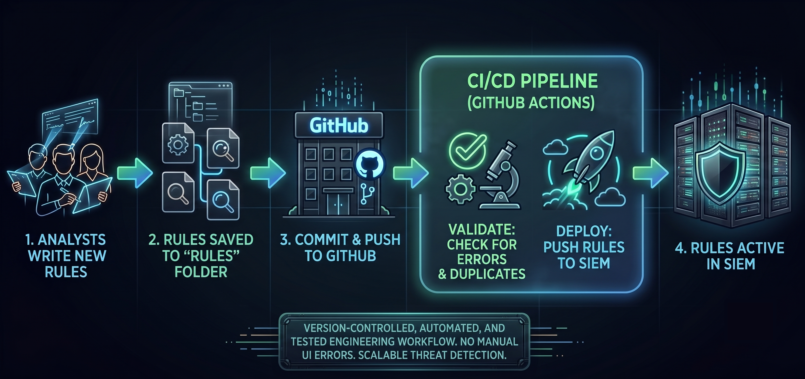

# Detection-as-Code (DaC) CI/CD Pipeline

[](https://github.com/RasheedFarhat/DaC-Pipeline/actions)


## Overview



A Detection-as-Code (DaC) pipeline that manages threat detection rules as version-controlled code. Detections are authored once in [Sigma](https://github.com/SigmaHQ/sigma) YAML, validated automatically in CI, and deployed as custom rules to a [Wazuh](https://wazuh.com/) SIEM via GitHub Actions.

## How it works

1. **Author** a detection in Sigma YAML (`rules/*.yml`), this is the single source of truth.
2. **Translate** it into the corresponding Wazuh XML rule (`rules/wazuh/*.xml`), linked back to the Sigma rule via a `sigma_uuid` reference.
3. **Open a pull request.** The validation workflow checks Sigma syntax, rule ID conventions, and that every Wazuh rule correctly maps back to a Sigma rule.
4. **Merge to `main`.** The deployment workflow pushes the Wazuh rules and agent configuration to a live Wazuh manager via its REST API and restarts the analysis engine.

## Repository structure

```
.
├── .github/workflows/
│   ├── check_rule_ids.yml      # CI: validation on pull requests
│   └── integrate_rulesets.yml  # CD: deploy rules to Wazuh on push to main
├── .pre-commit-config.yaml     # Local validation hooks (run on git commit)
├── configs/
│   └── agent.conf              # Wazuh agent group configuration
├── rules/
│   ├── *.yml                   # Sigma detection rules (source of truth)
│   └── wazuh/*.xml             # Corresponding Wazuh custom rules
├── scripts/
│   ├── validate_sigma.py       # Validates Sigma syntax + compiles via pySigma
│   ├── check_rule_ids.py       # Enforces ID rules and Sigma<->Wazuh linkage
│   └── deploy_rule.py          # Deploys rules/config to a Wazuh manager
├── tests/
│   ├── fixtures/                # Deliberately broken rules for testing validators
│   └── test_*.py                # pytest harness for validate_sigma.py / check_rule_ids.py
└── requirements.txt
```

## Example Detections Included

| Sigma rule | Wazuh ID | Level | MITRE ATT&CK | Description |
|---|---|---|---|---|
| `sysmon_wmic_xsl_bypass.yml` | 100005 | 12 | T1220 | `wmic.exe os get /format:` with a remote/local `.xsl` payload — AppLocker bypass |
| `sysmon_certutil_download.yml` | 100006 | 10 | T1105 | `certutil.exe` used with `urlcache`/`split` to download files (LOLBin) |
| `lnx_clear_cmd_history.yml` | 100010 | 10 | T1070.003 | `.bash_history` modified or cleared (defense evasion) |

## Prerequisites

- Python 3.11+
- Git
- A reachable Wazuh manager with API access (only required for deployment)

## Getting started

### 1. Clone and set up the environment

```bash
git clone https://github.com/RasheedFarhat/DaC-Pipeline.git
cd DaC-Pipeline

python3 -m venv venv
source venv/bin/activate        # On Windows: venv\Scripts\activate

pip install -r requirements.txt
pre-commit install              # Initialize local git hooks
```

### 2. Validate the existing rules locally

```bash
# Check that every Sigma rule is syntactically valid and compiles to a backend
python scripts/validate_sigma.py

# Check ID conventions, duplicates, and Sigma <-> Wazuh linkage
python scripts/check_rule_ids.py

# Run the test suite to confirm the validators themselves catch known-bad rules
pytest -v tests/
```

All three exit non-zero on failure. `validate_sigma.py` and `check_rule_ids.py` already run automatically on every pull request via `.github/workflows/check_rule_ids.yml`, and locally via pre-commit hooks (see below) before a commit is even made.

### Local validation with pre-commit (recommended)

To catch invalid rules before they're even committed:

```bash
pip install pre-commit
pre-commit install
```

Now `validate_sigma.py` and `check_rule_ids.py` run automatically on every `git commit`, blocking the commit if either fails.

### 3. Add a new detection

**a. Write a Sigma rule** in `rules/your_rule_name.yml` with a unique `id` (UUID v4):

```yaml
title: Example Detection
id: 11111111-2222-3333-4444-555555555555
status: experimental
description: What this rule detects and why
logsource:
    product: windows
    category: process_creation
detection:
    selection:
        CommandLine|contains: "example_string"
    condition: selection
level: medium
tags:
    - attack.execution
```

**b. Author the matching Wazuh rule** in `rules/wazuh/<name>.xml`. The custom rule `id` must be an integer **≥ 100000** and unique across the repo, and must reference the Sigma rule's UUID so `check_rule_ids.py` can verify the link:

```xml
<group name="windows,sysmon,">
  <rule id="100020" level="10">
    <info type="sigma_uuid">11111111-2222-3333-4444-555555555555</info>
    <field name="win.eventdata.commandLine" type="pcre2">(?i)example_string</field>
    <description>Example Detection</description>
    <mitre>
      <id>T1059</id>
    </mitre>
  </rule>
</group>
```

**c. Validate locally**, then open a PR against `dev` or `main`:

```bash
python scripts/validate_sigma.py && python scripts/check_rule_ids.py
```

### 4. Deploy to a Wazuh manager

Deployment runs automatically from `main` via `integrate_rulesets.yml`, but `deploy_rule.py` can also be run manually against any Wazuh manager.

**Required credentials** (set as environment variables locally, or as repository secrets for CI):

| Variable | Description |
|---|---|
| `WAZUH_API_URL` | Wazuh manager API URL, e.g. `https://wazuh.example.com:55000` |
| `WAZUH_USER` | API user with permission to manage rules, group configs, and restart the manager |
| `WAZUH_PASSWORD` | API password for that user |
| `WAZUH_VERIFY_TLS` | Set to `False` to bypass certificate validation (defaults to `True`) |
| `WAZUH_CA_BUNDLE` | Optional file path to a custom CA certificate bundle |

**TLS verification is enabled by default.** For self-signed Wazuh installs, set `WAZUH_VERIFY_TLS=false` to disable verification, or — preferably — set `WAZUH_CA_BUNDLE=/path/to/ca.pem` to verify against a custom CA without disabling verification entirely.

**Preview before deploying:** run with `--dry-run` to fetch the currently-deployed rules and print a diff against what would be uploaded, without modifying the SIEM:

```bash
python scripts/deploy_rule.py --dry-run
```

> Note: `--dry-run`'s remote-rule-content parsing has not yet been validated against a live Wazuh manager — if the diff output looks unexpected, this is the first place to check.

**Run the deployment script manually:**

```bash
export WAZUH_API_URL="https://127.0.0.1:55000"
export WAZUH_USER="your-api-user"
export WAZUH_PASSWORD="your-api-password"

python scripts/deploy_rule.py
```

This will:
- Authenticate to the Wazuh API
- Upload every `.xml` file in `rules/wazuh/` to the manager
- Push `configs/agent.conf` to the `default` agent group
- Restart the manager so the new rules and configuration take effect (polls for health status before exiting)

**For automated deployment via GitHub Actions**, add the three variables above as repository secrets under **Settings → Secrets and variables → Actions**, then push a change to `rules/**.yml` on `main`.

## Configuration reference

`configs/agent.conf` configures `syscheck` on Wazuh agents in the `default` group to monitor `.bash_history` files (`/root/.bash_history` and `/home/*/.bash_history`) in real time — this is the telemetry source for the `lnx_clear_cmd_history` detection above.

## Strategic Value
* **Risk Mitigation:** Eliminates manual errors causing SIEM outages.
* **Traceability:** Every rule modification is tracked via Git commits and Pull Requests.
* **Operational Maturity:** Infrastructure manages deployment; analysts focus on threat intelligence.

## Architectural Decisions & Known Limitations

**pySigma Wazuh Compiler Limitation**
Currently, there is no official `pysigma-backend-wazuh` package published on the Python Package Index (PyPI). To maintain pipeline integrity without relying on unstable tooling, the architecture implements the following calculated tradeoff:

1. **Validation (CI):** Sigma rules are validated during the Pull Request phase using the `pysigma-backend-elasticsearch` module. This proves the YAML detection logic is structurally correct and fully compilable.
2. **Deployment (CD):** Because we cannot generate Wazuh XML on the fly via `pip` modules, the Wazuh-compatible `.xml` files are currently maintained in the `rules/wazuh/` directory. The deployment script (`deploy_rule.py`) idempotently pushes these XMLs to the Wazuh Manager via its REST API.

*Future Roadmap: Once a stable pySigma Wazuh backend is officially released, the XML files will be removed from version control entirely. The CI/CD pipeline will be updated to compile the XML artifacts dynamically directly from the Sigma source immediately before deployment.*

**Dry-Run Remote Diff (Unverified)**
The `--dry-run` flag in `deploy_rule.py` fetches and parses the currently-deployed rule content from the Wazuh API to generate a diff. This parsing logic handles two possible response shapes defensively but has not yet been exercised against a live manager. If the response shape differs from both anticipated cases, the script will report all rules as "NEW FILE" rather than diffing them — this would be a silent misclassification, not an error. *Future work: validate against a live manager and add explicit error logging if the response shape doesn't match either expected case.*

## License

This project is licensed under the [MIT License](LICENSE).