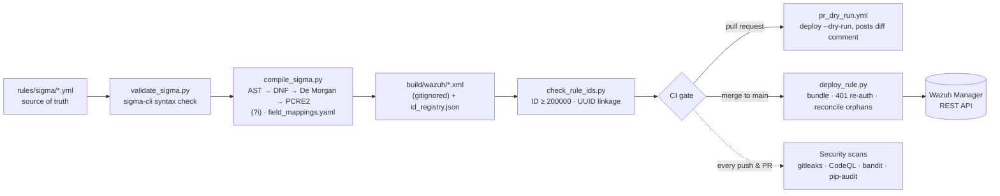

# Detection-as-Code Pipeline · Sigma → Wazuh

[](https://github.com/RasheedFarhat/DaC-Pipeline/actions/workflows/integrate_rulesets.yml)
[](https://github.com/RasheedFarhat/DaC-Pipeline/actions/workflows/gitleaks.yml)
[](https://github.com/RasheedFarhat/DaC-Pipeline/actions/workflows/codeql.yml)
[](https://github.com/RasheedFarhat/DaC-Pipeline/actions/workflows/bandit.yml)
[](https://github.com/RasheedFarhat/DaC-Pipeline/actions/workflows/pip-audit.yml)


Author a threat detection **once** in [Sigma](https://github.com/SigmaHQ/sigma) YAML; a
custom compiler translates it into native [Wazuh](https://wazuh.com/) PCRE2 XML, CI
validates and ID-stabilizes it, and CD deploys it to a live Wazuh manager — every change
peer-reviewed, unit-tested, and mapped to MITRE ATT&CK.

> **Why this is more than a script:** No official `pysigma-backend-wazuh` exists on PyPI,
> so `scripts/compile_sigma.py` is a **from-scratch compiler**. It walks the Sigma
> detection AST, distributes it into disjunctive normal form (capped at 500 DNF clauses —
> `MAX_AND_CLAUSE_PRODUCT` — so a pathologically OR-heavy rule fails the build loudly
> instead of hanging or exhausting memory), applies **De Morgan's law** to negations,
> merges same-field literals into Wazuh PCRE2 (lookahead conjunction for positives,
> alternation for negatives), emits case-insensitive `(?i)` matches to mirror Sigma
> semantics, and resolves Sigma field names through an external `field_mappings.yaml`
> — covered by 71 unit tests. For a stage-by-stage trace of how one real rule becomes
> Wazuh PCRE2 XML — AST, DNF, De Morgan, the PCRE2 merge, and the honest scope limits —
> see [`docs/COMPILER.md`](docs/COMPILER.md).
>
> A companion tool, [`scripts/sigmahq_coverage.py`](scripts/sigmahq_coverage.py), measures
> how much of the upstream [SigmaHQ](https://github.com/SigmaHQ/sigma) ruleset this
> compiler already handles — see [Importing from SigmaHQ](#importing-from-sigmahq) below.

## 30-second tour

```bash
python3 -m venv venv && source venv/bin/activate
pip install -r requirements.txt
make all        # clean → compile Sigma → validate IDs → run tests (71 passing)
```

`make all` compiles the current **58** Sigma rules (3 hand-authored examples + 55 imported
from SigmaHQ) into **216** Wazuh rules — some rules fan out to multiple Wazuh IDs via DNF
distribution (`sysmon_wmic_xsl_bypass.yml` alone compiles to 12) — validates every ID and
Sigma↔Wazuh UUID link, and runs the suite. Detection coverage currently spans **119
distinct MITRE ATT&CK techniques across all 14 tactics**; see
[`docs/COVERAGE.md`](docs/COVERAGE.md) for the full per-rule breakdown against the pinned
upstream SigmaHQ ref.

## Architecture



## How it works

1. **Author** a detection in Sigma YAML under `rules/sigma/` — the single source of truth.
2. **Compile** with `compile_sigma.py`: the detection condition is parsed into an AST,
   evaluated into disjunctive normal form, mapped from Sigma field names to Wazuh field
   names via the external `field_mappings.yaml`, rendered through
   `templates/wazuh_rule.xml.j2`, and written to `build/wazuh/` (gitignored — a regenerable
   build artifact). Stable Wazuh rule IDs are assigned from `id_registry.json` and committed
   back.
3. **Validate** with `check_rule_ids.py`: every Wazuh ID must be an integer ≥ 200000, every
   XML must carry a `<!-- sigma_uuid:UUID -->` comment linking it to a Sigma rule, and no
   IDs or UUIDs may collide.
4. **Open a pull request.** CI runs tests → Sigma syntax → compile → ID validation; the
   security scanners (gitleaks, CodeQL, bandit, pip-audit) run as their own checks; and
   `pr_dry_run.yml` posts a deployment dry-run diff as a PR comment.
5. **Deploy** (`deploy.yml`, manual `workflow_dispatch` on a self-hosted runner):
   `deploy_rule.py` bundles all rules into one file, PUTs them to the Wazuh API
   (re-authenticating once on a 401), reconciles orphaned rules behind a blast-radius
   safeguard, pushes `configs/agent.conf`, and restarts the manager.

## Repository structure

```
.
├── .github/
│   ├── workflows/
│   │   ├── integrate_rulesets.yml  # CI: test → validate → compile → validate IDs
│   │   ├── deploy.yml              # CD: same steps + deploy to Wazuh (manual dispatch)
│   │   ├── pr_dry_run.yml          # PR: deploy --dry-run, posts result as a comment
│   │   ├── gitleaks.yml            # secret scanning (full history)
│   │   ├── codeql.yml              # Python SAST
│   │   ├── bandit.yml              # Python SAST
│   │   └── pip-audit.yml           # dependency CVE scanning
│   └── dependabot.yml              # weekly pip + github-actions updates (grouped)
├── rules/sigma/*.yml               # Sigma detection rules (source of truth)
│   └── sigmahq/*.yml               # curated imports from SigmaHQ (DRL 1.1 — see below)
├── build/wazuh/*.xml               # Compiled Wazuh rules (gitignored, regenerated)
├── scripts/
│   ├── validate_sigma.py           # sigma-cli syntax validation
│   ├── compile_sigma.py            # Sigma AST → Wazuh PCRE2 XML compiler
│   ├── check_rule_ids.py           # ID conventions + Sigma↔Wazuh UUID linkage
│   ├── deploy_rule.py              # Bundles + deploys rules to a Wazuh manager
│   └── sigmahq_coverage.py         # fetch/report/import against upstream SigmaHQ
├── docs/
│   ├── COMPILER.md                 # guided trace through the compiler internals
│   └── COVERAGE.md                 # generated: per-rule compile status vs. SigmaHQ
├── templates/wazuh_rule.xml.j2     # Jinja2 template for Wazuh XML output
├── hooks/pre-push                  # tests + compile + validate; `make install-hooks` to enable
├── field_mappings.yaml             # Sigma field name → Wazuh decoder field name
├── id_registry.json                # sigma_uuid → wazuh_id (must be committed)
├── pipeline.yaml                   # Central path/deploy/SigmaHQ-import config
├── configs/agent.conf              # Wazuh agent group config (deployed with rules)
├── requirements.in                 # direct dependencies (source of truth)
├── requirements.txt                # pip-compile-generated lock
├── THIRD_PARTY_NOTICES.md          # DRL 1.1 licensing for imported SigmaHQ rules
├── SECURITY.md · CONTRIBUTING.md   # disclosure policy · contributor guide
└── tests/                          # pytest suite + deliberately-broken fixtures
```

## Example detections

Three hand-authored rules illustrate the compiler's core mechanics:

| Sigma rule | Wazuh ID(s) | Level | MITRE ATT&CK | Description |
|---|---|---|---|---|
| `lnx_clear_cmd_history.yml` | 200000 | high | T1070.003 | `.bash_history` modified or cleared (defense evasion) |
| `sysmon_certutil_download.yml` | 200001 | high | T1105 | `certutil.exe` with `urlcache`/`split` to download files (LOLBin) |
| `sysmon_wmic_xsl_bypass.yml` | 200005–200016 | high | T1220 | `wmic os get /format:` with a remote/local `.xsl` payload — AppLocker bypass. Compiles to **12** Wazuh rules: the compiler distributes its nested OR conditions into DNF, one rule per alternative. |

The remaining 55 rules are curated imports from SigmaHQ — see
[Importing from SigmaHQ](#importing-from-sigmahq) below and
[`docs/COVERAGE.md`](docs/COVERAGE.md) for the full catalog.

## Prerequisites

- Python 3.11+
- A reachable Wazuh manager with API access (only required for deployment)

## Getting started

```bash
git clone https://github.com/RasheedFarhat/DaC-Pipeline.git && cd DaC-Pipeline
python3 -m venv venv && source venv/bin/activate   # Windows: venv\Scripts\activate
pip install -r requirements.txt
pre-commit install                                  # local hooks: validators + mypy
make install-hooks                                  # pre-push: tests + compile + validate
```

### Validate and build locally

```bash
python scripts/validate_sigma.py   # Sigma syntax (sigma-cli)
python scripts/compile_sigma.py    # Sigma → build/wazuh/*.xml
python scripts/check_rule_ids.py   # ID conventions + Sigma↔Wazuh linkage
pytest -v tests/                   # 71 tests covering compiler + deploy + coverage tool
# or simply:  make all
```

All steps exit non-zero on failure. The same checks run in CI on every pull request and
locally via pre-commit before a commit is made.

### Add a new detection

Write a Sigma rule in `rules/sigma/<name>.yml` with a unique `id` (UUID v4):

```yaml
title: Example Detection
id: 11111111-2222-3333-4444-555555555555
status: experimental
description: What this rule detects and why
logsource:
    product: windows
    category: process_creation
detection:
    selection:
        CommandLine|contains: "example_string"
    condition: selection
level: medium
tags:
    - attack.execution
    - attack.t1059
```

Then `make compile` — the compiler auto-assigns a Wazuh ID (≥ 200000), writes the XML to
`build/wazuh/`, and records the `sigma_uuid → wazuh_id` mapping in `id_registry.json`.

> **Field mappings:** if your rule uses a Sigma field that isn't in `field_mappings.yaml`,
> add it there. An unmapped field passes through unchanged to a name no Wazuh decoder
> populates, so the rule would compile but **never fire**.

> **Always commit `id_registry.json`** alongside a new rule — the compiler rewrites it, and
> forgetting leaves IDs unstable across CI runs.

### Importing from SigmaHQ

`scripts/sigmahq_coverage.py` measures how much of the upstream
[SigmaHQ](https://github.com/SigmaHQ/sigma) ruleset this compiler can already handle, and
optionally imports a curated selection of the rules that compile clean:

```bash
python scripts/sigmahq_coverage.py fetch --ref r2026-04-01   # sparse-clone the pinned scope
python scripts/sigmahq_coverage.py report --ref r2026-04-01  # writes docs/COVERAGE.md
python scripts/sigmahq_coverage.py import --ref r2026-04-01 --allow uuids.txt --apply
```

- **`fetch`** sparse-clones only the scoped upstream path (`rules/windows/process_creation`,
  configured in `pipeline.yaml`) into the gitignored `build/sigmahq_cache/` — nothing
  upstream is vendored into git history.
- **`report`** runs every rule in scope through the *same* fail-loud checks
  `compile_sigma.py` uses for real, and buckets each as clean / unmapped-field / failed by
  whichever construct blocked it — see [`docs/COVERAGE.md`](docs/COVERAGE.md) for the
  current numbers.
- **`import`** copies only rules that verifiably compiled clean into
  `rules/sigma/sigmahq/`, with a provenance header (source path, pinned ref/commit, import
  date). It refuses to bulk-import the entire clean bucket — `--limit` and/or `--allow`
  must narrow the selection to a human-reviewed set.

SigmaHQ ships under the **Detection Rule License (DRL) 1.1**, not this repo's MIT license
— see [`THIRD_PARTY_NOTICES.md`](THIRD_PARTY_NOTICES.md).

### Deploy to a Wazuh manager

Deployment runs from `deploy.yml` (manual dispatch), but `deploy_rule.py` can be run
directly. Configuration is read from `pipeline.yaml`, a local `.env`, and environment
variables (env vars win).

| Variable | Description |
|---|---|
| `WAZUH_API_URL` | Manager API URL, e.g. `https://wazuh.example.com:55000` |
| `WAZUH_USER` | API user able to manage rules, group configs, and restart the manager |
| `WAZUH_PASSWORD` | API password for that user |
| `WAZUH_VERIFY_TLS` | `false` to skip cert verification (defaults to **`true`**) |
| `WAZUH_CA_BUNDLE` | Optional path to a custom CA bundle (verify without disabling TLS) |

TLS verification is **on by default**. For self-signed installs, prefer
`WAZUH_CA_BUNDLE=/path/to/ca.pem` over disabling verification.

```bash
python scripts/deploy_rule.py --dry-run   # simulate; never touches the manager
python scripts/deploy_rule.py             # authenticate, bundle, deploy, reconcile, restart
```

For CI/CD, add the variables as repository secrets under
**Settings → Secrets and variables → Actions** and dispatch `deploy.yml`.

## Security

Every change is gated by automated security scanning — each its own CI check — and all
GitHub Actions are pinned to immutable commit SHAs (not floating tags):

- **gitleaks** — full-history secret scanning, so a committed credential is caught on the PR
  that introduces it.
- **CodeQL** and **bandit** — Python static analysis (SAST).
- **pip-audit** — dependency CVE scanning of `requirements.txt`.
- **Dependabot** — weekly dependency and action updates, with minor/patch bumps grouped.
  Direct dependencies are tracked via `requirements.in`; `requirements.txt` is the
  `pip-compile`-generated lock, so transitive pins don't generate their own PRs.

Never commit `.env` or `.secrets` (both are gitignored). See
[`THREAT_MODEL.md`](THREAT_MODEL.md) for the pipeline's trust boundaries, supply-chain
surface, and the rationale behind the deploy safeguards; [`SECURITY.md`](SECURITY.md)
for the vulnerability-disclosure policy and credential handling; and
[`CONTRIBUTING.md`](CONTRIBUTING.md) for the contributor workflow.

## Design decisions & known limitations

- **No pySigma Wazuh backend exists**, so Sigma rules are *validated for compilability*
  using `pysigma-backend-elasticsearch`, while the Wazuh XML is generated by the custom AST
  walker in `compile_sigma.py`. This is the project's core, not a workaround.
- **`--dry-run` remote diff is unverified against a live manager.** If the API response
  shape differs from the two cases handled, it silently treats all rules as new. Validating
  this against a live manager is tracked future work.

## License

[MIT](LICENSE)
