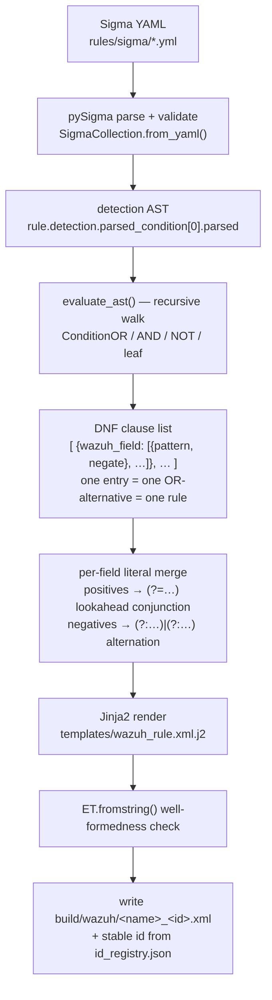

# Inside the compiler: how a Sigma rule becomes Wazuh PCRE2 XML

A guided trace through [`scripts/compile_sigma.py`](../scripts/compile_sigma.py).
This is not an API reference — it follows **one real shipped rule** through every
stage of the transform and shows the actual intermediate form at each step. Line
references point at the code as it stands today (re-verified against the current
file line-by-line, not carried over from an earlier revision).

Current state, for context: this compiler builds **58 Sigma rules** (3
hand-authored + 55 curated imports from [SigmaHQ](https://github.com/SigmaHQ/sigma))
into **216 Wazuh rules**, spanning **119 distinct MITRE ATT&CK techniques across
all 14 tactics** — see [`docs/COVERAGE.md`](COVERAGE.md) and
[`scripts/sigmahq_coverage.py`](../scripts/sigmahq_coverage.py), the companion tool
that measures how much of an upstream Sigma ruleset this compiler already handles
before any of it is imported.

## The problem

There is **no official `pysigma-backend-wazuh`** on PyPI. pySigma ships backends
for Elasticsearch, Splunk, QRadar, and others — but not for Wazuh's rule XML, which
matches log fields with PCRE2 regular expressions rather than a query language. So
this repo can't just call a backend's `.convert()`. `compile_sigma.py` is a
**from-scratch compiler**: it reuses pySigma only to *parse and validate* the rule
into an AST, then walks that AST itself and emits Wazuh `<rule>` XML.

(The CI Sigma check, `scripts/validate_sigma.py`, runs the rule through the
Elasticsearch backend purely to prove it's well-formed and compilable. That backend
output is never deployed — the Wazuh XML comes entirely from the walker described
here.)

### What subset of Sigma is supported

The walker handles the part of Sigma that string-matches process/file telemetry:

- **String matching** with `contains`, `startswith`, `endswith`, and plain equality.
- **Wildcards** `*` (→ `.*`) and `?` (→ `.`).
- **`|contains|all`** — multiple substrings ANDed on one field.
- **Boolean composition** — `and`, `or`, `not`, and grouped sub-conditions.
- **Selection aggregators** — `1 of selection*`, `all of selection*`, `all of them`
  (pySigma pre-expands these into `or`/`and` nodes before the walker runs, so they
  work for free — see [What it doesn't support yet](#what-it-doesnt-support-yet),
  which corrects a common assumption).
- **`not` exclusion**, including De Morgan over an inner `or`.
- **Case-insensitive matching** to mirror Sigma semantics.
- **Field-name mapping** (Sigma → Wazuh decoder field) via `field_mappings.yaml`.
- **MITRE technique-tag** extraction into `<mitre><id>`.
- **Cartesian-product safety cap** — nested OR/AND structures distribute into DNF
  up to `MAX_AND_CLAUSE_PRODUCT` (500) combinations; larger ones fail the build
  rather than hang or exhaust memory — see [Decision 4](#4-cartesian-product-cap-on-and-distribution).

Everything outside that — numeric comparisons, regex/CIDR/base64 modifiers,
keyword (field-less) matching — is either rejected at build time or unsound; the
honest list is at the end.

## The transform, end to end



The core data structure (the thing flowing along the middle of that diagram) is the
return type of `evaluate_ast` (`scripts/compile_sigma.py:201`):

> a **list of OR-alternatives**, where each alternative maps a Wazuh field name to a
> **list of `{"pattern": str, "negate": bool}` literals**.

One list entry becomes one Wazuh `<rule>`. One field carrying two literals becomes
two `<field>` elements that Wazuh ANDs together.

## Stage-by-stage trace: `sysmon_certutil_download.yml`

### 0. The source rule

`rules/sigma/sysmon_certutil_download.yml`:

```yaml
detection:
    selection:
        Image|endswith: '\certutil.exe'
        CommandLine|contains|all:
            - 'urlcache'
            - 'split'
    condition: selection
```

Detection in English: the process image ends with `\certutil.exe` **and** the
command line contains **both** `urlcache` **and** `split` — the classic
`certutil -urlcache -split -f <url>` download invocation (T1105).

### 1. Parse → AST

`SigmaCollection.from_yaml()` (`compile_sigma.py:350`) parses and validates the
rule; `rule.detection.parsed_condition[0].parsed` (`:361`) is the root AST node.
For this rule the tree is:

```
ConditionAND
├─ ConditionFieldEqualsValueExpression  field='Image'        value='*\certutil.exe'
└─ ConditionAND
   ├─ ConditionFieldEqualsValueExpression  field='CommandLine'  value='*urlcache*'
   └─ ConditionFieldEqualsValueExpression  field='CommandLine'  value='*split*'
```

Two things pySigma did for us before the walker even runs: `|endswith` became a
leading-`*` `SigmaString`, and `|contains|all` expanded into a nested `ConditionAND`
of two `*…*` `CommandLine` leaves.

### 2. Walk the leaves → patterns

`evaluate_ast` recurses to the bottom and hits the leaf branch
(`compile_sigma.py:239`). Each `ConditionFieldEqualsValueExpression` becomes one
regex literal:

- **Field mapping** (`:256`): `Image` → `win.eventdata.image`,
  `CommandLine` → `win.eventdata.commandLine`, via `field_mappings.yaml`. An unmapped
  field passes through unchanged.
- **Wildcard → regex** (`:286-294`): each `*` becomes `.*`, each `?` becomes `.`,
  and every literal character is `re.escape`-d (so `.` in `certutil.exe` becomes
  `\.`).
- **Anchoring** (`:296-299`): if the value did *not* start with `*`, prepend `^`; if
  it did not end with `*`, append `$`. `endswith` (`*\certutil.exe`) starts wild but
  ends anchored → trailing `$`, no leading `^`.
- **Case-insensitivity** (`:301-304`): prepend `(?i)` — see [Decision 1](#1-i-case-insensitivity).

The three leaves produce:

| Leaf | Pattern |
|---|---|
| `Image` `*\certutil.exe` | `(?i).*\\certutil\.exe$` |
| `CommandLine` `*urlcache*` | `(?i).*urlcache.*` |
| `CommandLine` `*split*` | `(?i).*split.*` |

### 3. AND-merge → DNF clause

Walking back up, `ConditionAND` (`:215-217`) calls `_and_clauses`
(`:127-155`), which takes the cartesian product of its operands' alternatives
(`itertools.product`, `:146`) and merges same-field literals per clause via
`_merge_field_literals` (`:104`). Before distributing, `_and_clauses` checks the
product size against `MAX_AND_CLAUSE_PRODUCT` (`:125`, `:136-143`) and fails loud
if it would exceed 500 — see [Decision 4](#4-cartesian-product-cap-on-and-distribution).

Here every operand has exactly one alternative, so the product is a single clause.
The two `CommandLine` leaves collide on one field with the **same (positive)
polarity**, so they collapse via **lookahead conjunction** (`:122`):

```
(?=.*(?i).*urlcache.*)(?=.*(?i).*split.*)
```

Each `(?=…)` is a zero-width lookahead: "somewhere ahead, this matches." Chaining
two of them means *both* substrings must be present, in any order — exactly
`contains|all`. (There is no `or` and no `not` in this rule, so DNF distribution and
De Morgan are no-ops here — both are exercised in the next section.)

The full `evaluate_ast` return value, one alternative (regexes shown at on-disk
escaping — one `\` per literal backslash — rather than Python's doubled `json.dumps`
repr):

```json
[
  {
    "win.eventdata.image": [
      { "pattern": "(?i).*\\certutil\\.exe$", "negate": false }
    ],
    "win.eventdata.commandLine": [
      { "pattern": "(?=.*(?i).*urlcache.*)(?=.*(?i).*split.*)", "negate": false }
    ]
  }
]
```

### 4. Render → XML

`main` assigns a stable ID (`:373-384`, [Decision 3](#3-stable-ids-via-id_registryjson))
and renders through `templates/wazuh_rule.xml.j2`. The template's nested loop
(`wazuh_rule.xml.j2:5-9`) emits one `<field>` per literal, adding `negate="yes"`
only when the literal is negative (`:7`). The output is then parsed with
`ET.fromstring` (`compile_sigma.py:399`) as a well-formedness gate before it's
written to `build/wazuh/sysmon_certutil_download_200001.xml`:

```xml
<group name="windows, custom_sigma">
  <rule id="200001" level="10">
    <!-- sigma_uuid:c8d8b9e5-9c8f-4318-8f53-27df8a213564 -->
    <if_group>sysmon_event1</if_group>
    <field name="win.eventdata.image" type="pcre2">(?i).*\\certutil\.exe$</field>
    <field name="win.eventdata.commandLine" type="pcre2">(?=.*(?i).*urlcache.*)(?=.*(?i).*split.*)</field>
    <description>Suspicious Certutil Network Connection</description>
    <mitre>
      <id>T1105</id>
    </mitre>
  </rule>
</group>
```

(Whitespace-trimmed; the template leaves blank lines where loop tags were.) Wazuh
ANDs the two `<field>` elements, the `<if_group>sysmon_event1</if_group>` scopes it
to Sysmon Event ID 1, and the `<!-- sigma_uuid -->` comment is what
`check_rule_ids.py` later uses to prove the XML traces back to a Sigma source.

## Negation and DNF fan-out (traced on illustrative inputs)

None of the three hand-authored example rules use `or` or `not` directly, so the
following are minimal, illustrative inputs run through the **same compiler** to make
the DNF/De Morgan mechanics easy to follow in isolation. Real shipped rules exercise
both paths too — the imported `proc_creation_win_hktl_mimikatz_command_line.yml`'s
`1 of selection_*` condition is an OR across 23 alternatives, fanning out to 23
Wazuh rules the same way as the worked example below.

### DNF distribution — `selection and (a or b)`

```yaml
selection:  { Image|endswith: '\wmic.exe' }
payload:    { CommandLine|contains: ['.xsl', 'http://'] }
condition: selection and payload
```

The `or` inside `payload` makes `ConditionOR` (`:209-213`) return **two**
alternatives; `ConditionAND` distributes `selection` across both
(`itertools.product`). Result — **two clauses, i.e. two emitted rules**:

```json
[
  { "win.eventdata.image":[{"pattern":"(?i).*\\wmic\\.exe$","negate":false}],
    "win.eventdata.commandLine":[{"pattern":"(?i).*\\.xsl.*","negate":false}] },
  { "win.eventdata.image":[{"pattern":"(?i).*\\wmic\\.exe$","negate":false}],
    "win.eventdata.commandLine":[{"pattern":"(?i).*http://.*","negate":false}] }
]
```

This is exactly why the shipped `sysmon_wmic_xsl_bypass.yml` fans out to 12 Wazuh
rules: its nested `or`s multiply out into disjunctive normal form, one rule per
alternative, each getting its own stable ID (`UUID`, `UUID_1`, … at `:375`).

### De Morgan — `selection and not (a or b)`

```yaml
selection: { Image|endswith: '\powershell.exe' }
filter:    { CommandLine|contains: ['Get-Help', 'Get-Command'] }
condition: selection and not filter
```

`ConditionNOT` (`:219-237`) receives the child DNF (two clauses, one per `or`
branch), flips every literal's polarity, and ANDs the negated clauses back together
— the De Morgan identity `NOT(a OR b) == NOT(a) AND NOT(b)`. Both negated literals
land on the same field with the **same (negative) polarity**, so they merge via
**alternation** (`:120`) under a single `negate="yes"`:

```json
[
  { "win.eventdata.image":[{"pattern":"(?i).*\\powershell\\.exe$","negate":false}],
    "win.eventdata.commandLine":[
      {"pattern":"(?:(?i).*Get\\-Help.*)|(?:(?i).*Get\\-Command.*)","negate":true} ] }
]
```

Read it as: image is powershell **and** the command line matches *neither*
`Get-Help` *nor* `Get-Command`. Positives merge with lookaheads (AND); negatives
merge with alternation (OR-then-negate). That asymmetry is the whole trick of
`_merge_field_literals` (`:104-123`).

## Four non-obvious design decisions

### 1. `(?i)` case-insensitivity

`compile_sigma.py:301-304` prepends `(?i)` to every pattern. **Why:** Sigma string
matching is case-insensitive by default, but Wazuh's `pcre2` field type is
case-sensitive. Without the prefix, `CertUtil.exe` or `URLCACHE` would sail past a
rule written for `certutil`/`urlcache` — a trivial case-variant evasion that would
make the detection look present while being porous. The `(?i)` closes that gap by
mirroring Sigma's own semantics.

The honest wart: because the prefix is applied per-leaf and literals are later
wrapped in lookaheads, `(?i)` can end up mid-pattern, e.g.
`(?=.*(?i).*urlcache.*)`. PCRE2 scopes an inline `(?i)` to its enclosing group, and
each lookahead is its own group, so case-insensitivity still covers each substring
correctly — it's just visually noisier than a single leading flag.

### 2. Same-field mixed polarity → two `<field>` elements

When a field carries one positive and one negated literal (the common
`selection and not filter` exclusion on the same field), `_merge_field_literals`
(`:115-123`) does **not** try to combine them into one regex. It keeps them as two
separate literals:

```json
"win.eventdata.commandLine": [
  { "pattern": "(?i).*mimikatz.*", "negate": false },
  { "pattern": "(?i).*help.*",     "negate": true  }
]
```

→ two `<field>` elements, the second with `negate="yes"`. **Why:** Wazuh ANDs every
`<field>` in a rule, so "matches `mimikatz` **and** does **not** match `help`" is
expressed natively as two fields. Cramming a positive and a negative into a single
PCRE2 (a positive lookahead plus a negative lookahead) would be harder to read,
harder to validate, and easy to get subtly wrong; two elements map one-to-one onto
Wazuh's own AND semantics. Same-polarity literals still merge (lookahead /
alternation); only *mixed* polarity splits.

### 3. Stable IDs via `id_registry.json`

Wazuh rule IDs are assigned from a persisted map, not generated fresh each run
(`load_registry` `:308`, assignment `:373-384`, `save_registry` `:315`). On compile,
each rule's registry key — `UUID` for the first alternative, `UUID_1`, `UUID_2`, …
for DNF splits (`:375`) — is looked up; an existing key reuses its ID, a new key
gets `next_id` (max existing + 1, floor 200000, `:333-334`) and the registry is
rewritten. **Why:** without this, IDs would be positional and would churn every time
a rule was added, reordered, or split differently — each CI run would produce a
different ID for the same detection, breaking analyst muscle memory, dashboards,
alert correlation, and the reconcile step in `deploy_rule.py`. Persisting the map
makes the Sigma-UUID → Wazuh-ID binding **stable across runs**, which is why
`id_registry.json` must be committed alongside any new rule.

### 4. Cartesian-product cap on AND-distribution

`_and_clauses` (`compile_sigma.py:127-155`) distributes ANDed operands via
`itertools.product`, which is combinatorial: a handful of OR-heavy selections ANDed
together can multiply into millions of clauses. `MAX_AND_CLAUSE_PRODUCT = 500`
(`:125`) bounds this — the product size is computed and checked (`:136-143`)
*before* `itertools.product` runs (`:146`), raising a clear `ValueError` instead of
hanging or exhausting memory. **Why:** not theoretical — confirmed against the real
SigmaHQ corpus. 14 rules in the pinned `r2026-04-01` Windows `process_creation`
scope exceeded the cap, the worst by **33,554,432×**
(`proc_creation_win_browsers_chromium_headless_file_download.yml`). Rules that hit
it show up in [`docs/COVERAGE.md`](COVERAGE.md)'s `value_error:other` bucket.

## What it doesn't support yet

Honest scope. Verified against the current code:

| Sigma feature | Behavior today |
|---|---|
| **Numeric comparisons** (`\|lt \|lte \|gt \|gte`) | **Rejected at build (fails loud).** Reaches the leaf as a non-string value type (`SigmaCompareExpression`); the leaf raises a clear `NotImplementedError` — *"Unsupported Sigma value type"* (`:269`) — which `main` turns into a non-zero exit (`:420-422`). |
| **Regex modifier** (`\|re`) | **Rejected at build (fails loud)** — same leaf type-check (`SigmaRegularExpression`). |
| **CIDR modifier** (`\|cidr`) | **Rejected at build (fails loud)** — same leaf type-check (`SigmaCIDRExpression`). |
| **base64 / base64offset** (`\|base64`, `\|base64offset`) | **Rejected at build (fails loud).** `\|base64` is invisible at the leaf (pySigma leaves an ordinary `SigmaString`), so a pre-walk guard, `assert_supported_constructs` (`:177`), inspects each detection item's modifiers and raises `NotImplementedError` naming the modifier (`:192`). This closes the former silent false negative — an exact-match on the *encoded literal* (`(?i)^d2hvYW1p$` for `whoami`). |
| **Keyword / field-less matching** (a bare list with no field) | **Rejected at build (fails loud).** The non-field leaf now raises `NotImplementedError` (`:246-252`) instead of returning `[{}]`, closing the former match-everything rule (a `<rule>` with no `<field>`s). |
| **Empty / null field value** | **Rejected at build (fails loud).** An empty value (former silent `(?i)^$`) and a `SigmaNull` each raise a clear `ValueError` (`:277`, `:260`). |
| **Extremely large OR/AND fan-out** (>500 DNF clauses) | **Rejected at build (fails loud).** See [Decision 4](#4-cartesian-product-cap-on-and-distribution). |
| **`1 of` / `all of` aggregators** | **Supported** — pySigma expands `1 of selection*` into a `ConditionOR` and `all of …` into a `ConditionAND` *before* the walker runs, so they need no special handling. (Listed here because they're commonly assumed unsupported; they aren't.) |

Every unsupported construct above now **fails the build with a clear message**
rather than emitting a wrong rule — there are no longer any silent cases. The two
that used to be silent — **base64** (an exact-match on the encoded literal) and
**field-less keywords** (a match-everything rule) — were the same class of bug as
the `(?i)` case-variant evasion: a detection that looks deployed but is mis-targeted
or porous. They are now rejected at compile time and covered by regression tests in
`tests/test_compile_sigma.py`. Adding real support for one of these means teaching
the leaf handler (`compile_sigma.py:239` onward) — or `assert_supported_constructs`
for modifier-only cases — to translate the corresponding pySigma expression type,
then removing its guard.

## Where to look next

- The walker and merge logic: `scripts/compile_sigma.py` (`evaluate_ast` `:201`,
  `_merge_field_literals` `:104`, `_and_clauses` `:127`, cartesian-product cap
  `:125` / `:136-143`).
- The output shape: `templates/wazuh_rule.xml.j2`.
- The field map: `field_mappings.yaml`.
- The downstream ID/linkage gate: `scripts/check_rule_ids.py`.
- The SigmaHQ coverage/import tool that measures how much of an upstream ruleset
  this compiler already handles before any of it is imported:
  `scripts/sigmahq_coverage.py` (see [`docs/COVERAGE.md`](COVERAGE.md)).
- Test coverage for all of the above: `tests/test_compile_sigma.py`,
  `tests/test_sigmahq_coverage.py`.
